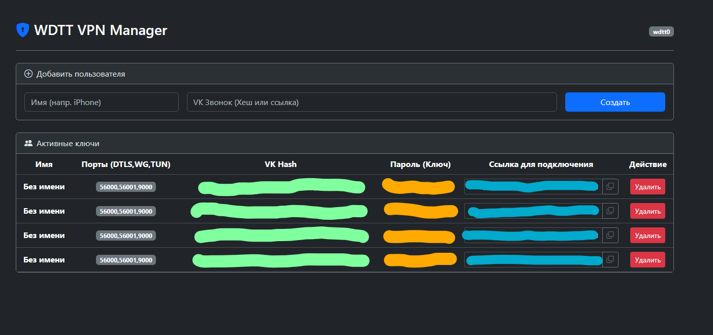

# WDTT VPN Manager

Легковесный VPN-сервер **WDTT** и веб-панель на Flask для удобного управления пользователями и ключами.

## О проекте
* **Панель:** Создание/удаление клиентов, копирование ссылок `wdtt://` через веб-интерфейс.
* **Туннелирование:** Готовый бинарный файл `wdtt-server` (маскировка под VK-звонки для обхода белых списков).
* **Службы:** Работает в фоновом режиме через Systemd. Сетевые настройки (NAT/Forwarding) применяются автоматически.

## Скрин


## Совместимые клиенты
Для подключения к созданному серверу используйте следующие приложения:
* **Android (Мобильный клиент):** [proxy-turn-vk-android](https://github.com/amurcanov/proxy-turn-vk-android)
* **Windows / Linux (ПК клиент):** [PWDTT](https://github.com/luminescq/PWDTT)


*Есть баг с тем, что ключам не присваиваются имена.*

*Скоро будет добавлена возможность редактировать и пересоздавать ключи.*

*Также скоро будет добавлена возможность ставить лимиты трафика на ключи, мониторить расход трафика на ключ и т. д.*


## Архитектура

```text
Android-приложение → VpnService / WireGuard GoBackend → локальный UDP
→ Go-клиент WDTT → WRAP RTP AEAD → VK TURN / DTLS → wdtt-server на VPS → интернет
```

(Порты настраиваются при установке, у вас их спросят в процессе установки.)

(Выбранные вами порты будут открыты автоматически.)

## Быстрая установка (Ubuntu 20.04+)
Установите Git, если не установлен.

```bash
sudo apt update
sudo apt install git -y
```

Выполните на чистом сервере под root: (Панель установится наружу по IP.)

```bash
git clone https://github.com/michaillepichow/wdtt-panel.git
cd wdtt-panel
chmod +x install.sh
sudo ./install.sh
```

Если хотите, чтобы панель работала локально (для работы через nginx и так далее)
Запустите с флагом --local

```bash
git clone https://github.com/michaillepichow/wdtt-panel.git
cd wdtt-panel
chmod +x install.sh
sudo ./install.sh --local
```

```
бинарник wdtt-server скомпилирован из официальных исходников wdtt
```

## Безопасность

Панель по умолчанию доступна по IP сервера.
Рекомендуется использовать обратный прокси nginx и HTTPS.


## 1. Если вам необходимо перезапустить, остановить или запустить компоненты сервера вручную:

*   **Перезапустить всё после изменений:**
    ```bash
    sudo systemctl restart wdtt-panel wdtt-vpn
    ```
*   **Остановить службы:**
    ```bash
    sudo systemctl stop wdtt-panel wdtt-vpn
    ```
*   **Проверить статус работы (активны ли процессы):**
    ```bash
    systemctl status wdtt-panel
    systemctl status wdtt-vpn
    ```

### 2. Просмотр логов в реальном времени

Логи помогают понять, кто подключается к серверу, происходят ли ошибки авторизации или сетевые сбои:

*   **Логи веб-панели (запросы, авторизация, добавление ключей):**
    ```bash
    journalctl -u wdtt-panel -f
    ```
*   **Логи VPN-сервера (подключения клиентов, трафик, работа DTLS):**
    ```bash
    journalctl -u wdtt-vpn -f
    ```

### 3. Сетевая диагностика

Проверка того, правильно ли сервер принимает трафик и работают ли порты:

*   **Проверить, запущены ли порты веб-панели и туннелей:**
    ```bash
    ss -tulpn | grep -E "wdtt|python"
    ```
    *(Вы должны увидеть порты панели, DTLS и WireGuard в режиме прослушивания).*

*   **Проверить, активно ли правило NAT (маскарадинг трафика):**
    ```bash
    sudo iptables -t nat -L POSTROUTING -n -v
    ```
    *(В выводе должно присутствовать правило с действием `MASQUERADE`).*

*   **Посмотреть статус сетевого форвардинга (пересылки пакетов):**
    ```bash
    sysctl net.ipv4.ip_forward
    ```
    *(Должно быть равно `net.ipv4.ip_forward = 1`).*


## Информацию, как работает WDTT, узнайте в официальном репозитории. [proxy-turn-vk-android](https://github.com/amurcanov/proxy-turn-vk-android)

## Требования

- Ubuntu 20.04+
- Root-доступ
- Белый IPv4 адрес
- 1 ГБ RAM (минимум)
- 1 CPU

## Лицензия

Этот проект распространяется под лицензией **GNU General Public License v3.0**.
